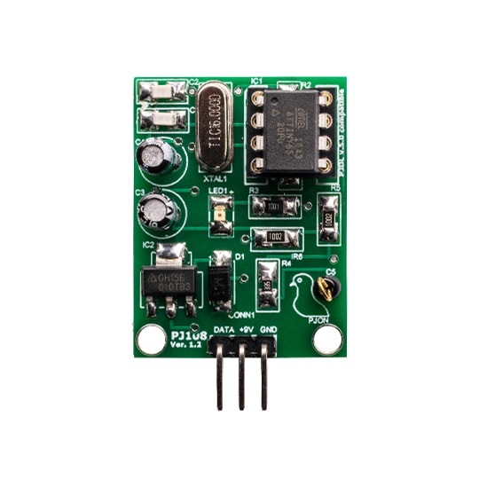
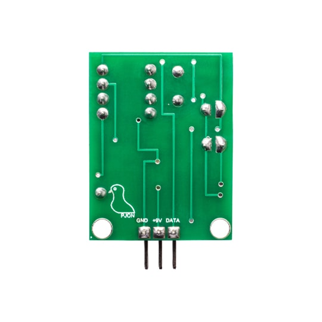

## PJ108


The PJ108 module is a 33x25mm open-source, stand-alone, programmable lightning strike sensor based on ATtiny85 with [PJON](https://github.com/gioblu/PJON/) over [PJDL](https://github.com/gioblu/PJON/blob/master/src/strategies/SoftwareBitBang/specification) networking. It needs only 3 pins (PJDL, 5v, GND) to operate transmitting samples and receiving incoming configuration on the same PJON IO pin.

```cpp  
 _______   _______   _______
|       | |       | |       |
| PJ108 | | PJ108 | | PJ108 |
|_______| |_______| |_______|
____|||_______|||_______|||______ SoftwareBitBang bus
_____||________||________||______ +9v
______|_________|_________|______ GND
```
Multiple PJ108s can be connected in parallel on the same [SoftwareBitBang](https://github.com/gioblu/PJON/tree/master/src/strategies/SoftwareBitBang) bus sharing the same power, ground and data connection. Each PJ108 is running an instance of the PJON protocol stack with its own configurable device id, so many can coexist on the same medium.

PJ108 has been engineered with the strong feeling that in the future "smart homes" will not necessarily host an embedded real-time operative system in whatever "thing" and expose vulnerabilities out of their physical boundaries. Otherwise, more probably, they will host many less power-hungry microcontrollers connected to a wired communication bus.

### Software
A basic example program is proposed to let users easily configure the PJ108s using only a series of commands on its PJON [SoftwareBitBang](https://github.com/gioblu/PJON/tree/master/src/strategies/SoftwareBitBang) bus to avoid flashing the chip multiple times. With the [Console](software/Console/Console.ino) example and an Arduino compatible device it is possible to input configuration and request samples with an easy to use console interface. PJ108 accepts incoming requests if sent by `PJON_MASTER_ID` and its configured recipient id.

| Command                          | Parameter     | Effect                                                            |
| -------------------------------- | --------------| ----------------------------------------------------------------- |
|  `?` Info                        | none          | Transmits module name and software version                        |
|  `E` Execute                     | none          | Reads the PIR sensor and transmits sample                         |
|  `I` Device id                   | `uint8_t`     | Sets device id                                                    |
|  `R` Recipient device id         | `uint8_t`     | Sets recipient id                                                 |
|  `Q` Configuration block         | none          | Blocks incoming configuration                                     |
|  `X` Configuration reset         | none          | Sets configuration to default                                     |

- `Q` For security reasons it is possible to block incoming configuration, although further configuration is possible flashing the [PJ108](software/PJ108/PJ108.ino) sketch on the ATtiny85 using an ISP programmer.

The ATtiny85 must to be flashed with the [PJ108](software/PJ108/PJ108.ino) sketch using an ISP programmer, see [ATtiny85 interfacing](https://github.com/gioblu/PJON/wiki/ATtiny-interfacing)

### How to install the software
The software is relatively easy to install:
- Follow [High-Low Tech tutorial](http://highlowtech.org/?p=1695) by David Mellis and install the required software.  
- Locate the Arduino IDE `boards.txt` file (in Windows is in `C:\Users\your-user-name\AppData\Local\Arduino15\packages\attiny\hardware\avr\1.0.1`)
- Add the code below at the end of the file and save it
```
attiny.menu.clock.external16BOD=PJON PJ100 modules
attiny.menu.clock.external16BOD.bootloader.low_fuses=0xfe
attiny.menu.clock.external16BOD.bootloader.high_fuses=0xdc
attiny.menu.clock.external16BOD.bootloader.extended_fuses=0xff
attiny.menu.clock.external16BOD.build.f_cpu=16000000L
```
- Open the Arduino IDE
- Program an Arduino with the ArduinoISP example
- Connect the Arduino to the ATtiny85 as described in the [High-Low Tech tutorial](http://highlowtech.org/?p=1695)
- Connect a 16MHz oscillator to the ATtiny85 to program it successfully
- Select Tools->Board->ATtiny
- Select Tools->Processor->ATtiny85
- Select Tools->Clock->PJON PJ100 modules
- Select Tools->Burn bootloader
- Open PJ108.ino
- Upload the program

The chip should be good to go.

### Schematic
The circuit is quite simple and can be tested quickly on a breadboard. It is composed by few components such as the MCU, its clock, the voltage regulator, a couple of resistors, capacitors and obviously the wire antenna.


### License
All software included in this repository is experimental and it is distributed "AS IS" without any warranty, use it at your own risk. [Licensed](https://github.com/gioblu/PJON/blob/master/LICENSE.md) under the Apache License, Version 2.0. PJON® and its brand are registered trademarks, property of PJON Technologies srl

### Safety warning
When installing or maintaining a PJON network, extreme care must be taken to avoid any danger. If devices are connected to AC power you are exposed to a high chance of being electrocuted if hardware is not installed carefully and properly. If you are not experienced enough ask the support of a skilled technician and consider that many countries prohibit uncertified installations. When a [SoftwareBitBang](https://github.com/gioblu/PJON/tree/master/src/strategies/SoftwareBitBang) bus is installed [interference mitigation](https://github.com/gioblu/PJON/wiki/Mitigate-interference) and [protective circuitry](https://github.com/gioblu/PJON/wiki/Protective-circuitry) guidelines must be followed. When working with an [AnalogSampling](https://github.com/gioblu/PJON/tree/master/src/strategies/AnalogSampling) LED or laser based setup safety glasses must be worn and transceivers must be operated cautiously to avoid potential eye injuries. When connecting a local bus to the internet all devices must be considered potentially compromised, manipulated or remotely actuated against your will. It should be considered a good practice not to connect to the internet systems that may create a damage (fire, flood, data-leak) if hacked.
